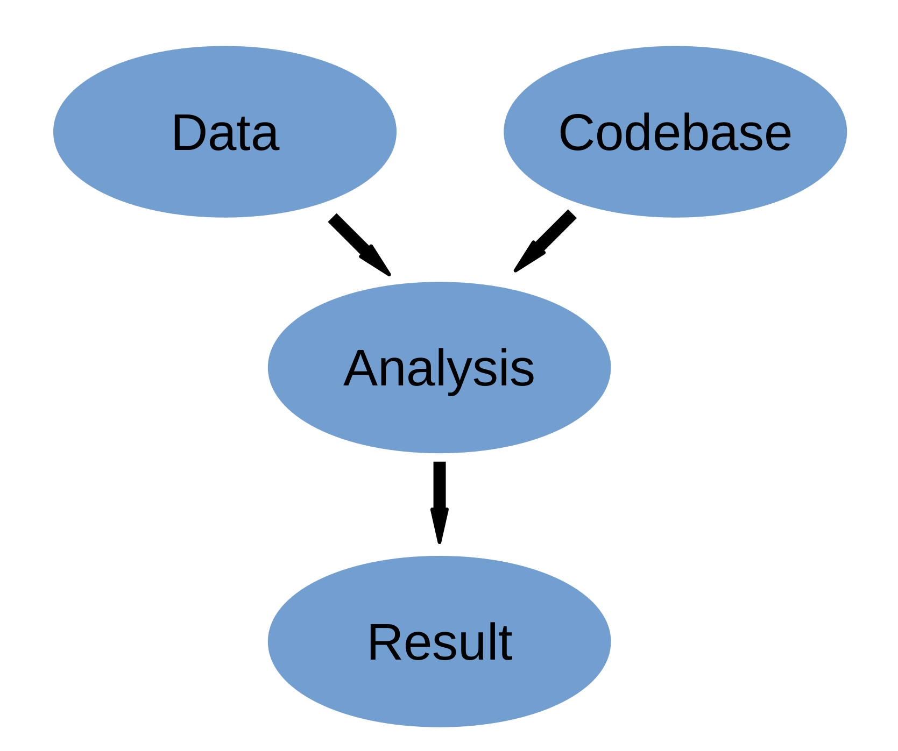
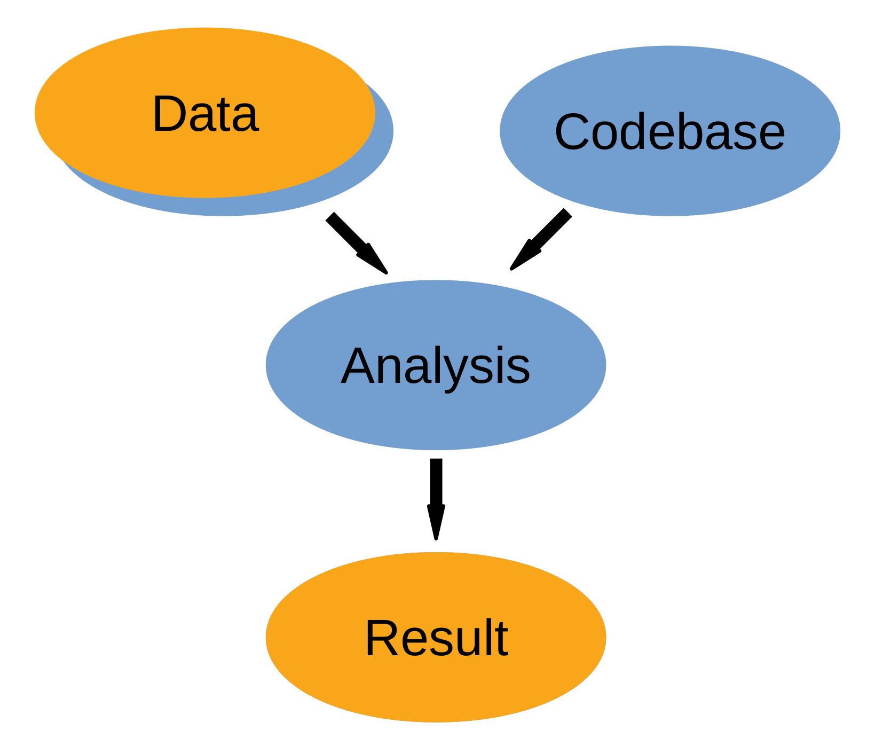
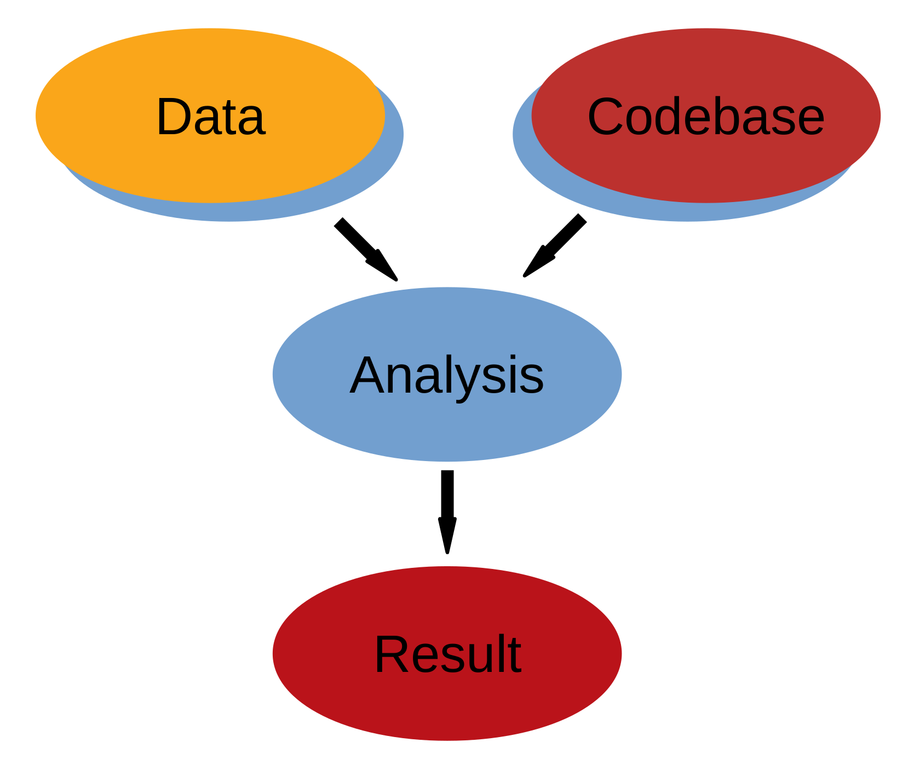
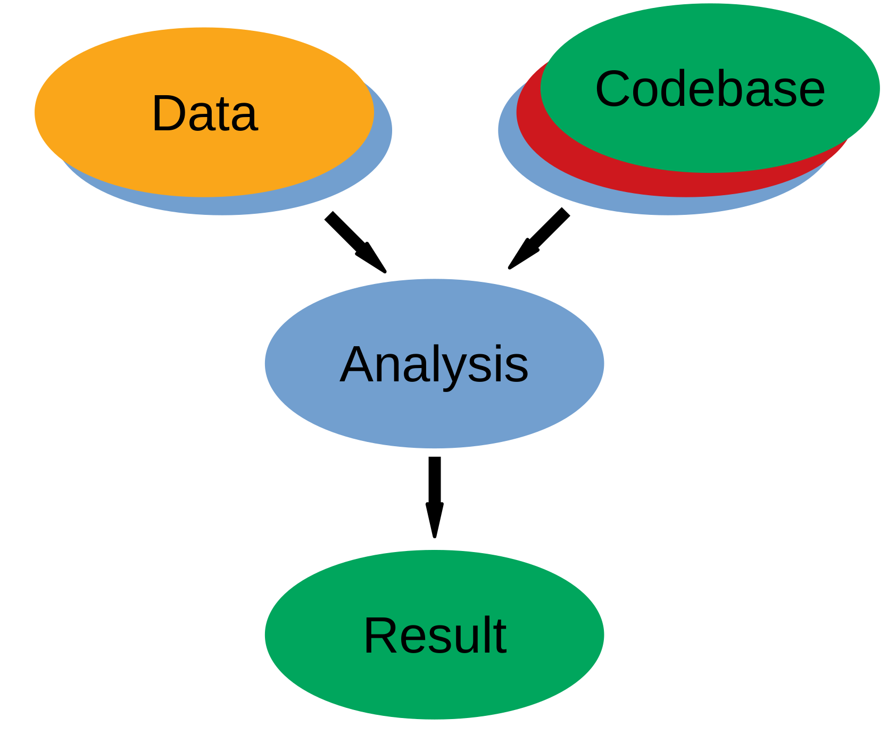
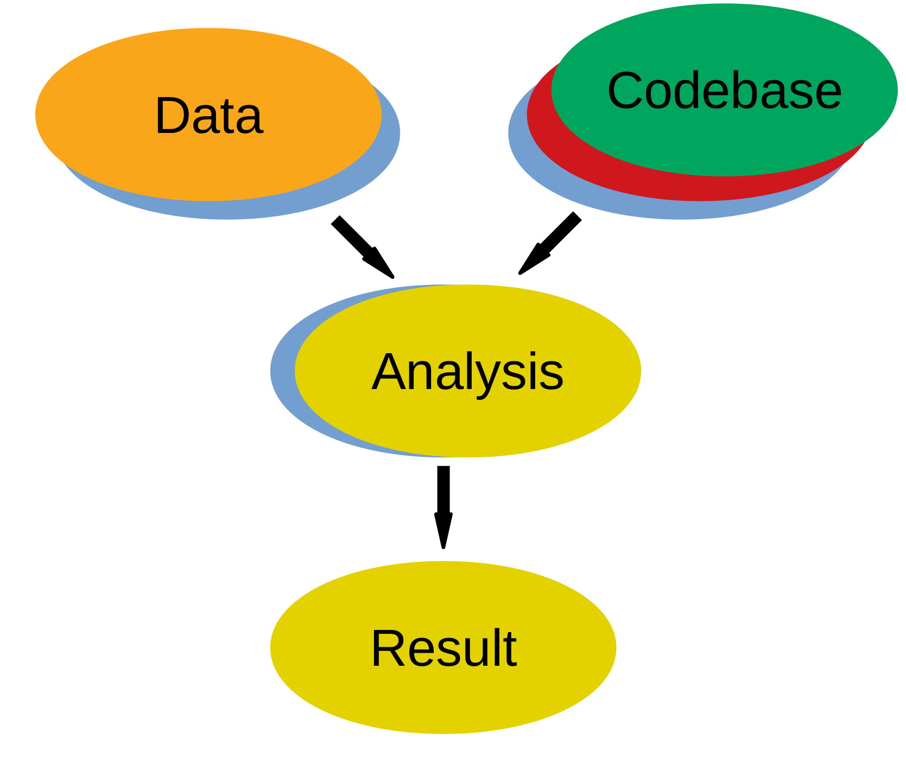

# Commit to Git?

#### A short introduction to version control in computational sciences

<br>
<br>

04.12.2024
Julian Karl Bauer

<!--
Thank you for the kind introduction
and thanks for inviting me.

I really liked the presentation
'...'
Emil gave in the last Students Chapter.

An important building block for all the things Emil had talked about is version control.
This gave me motivation to kind of recycle a talk on Git basics I gave several years ago.

Probabyl the world changed and all of you have a profound understaning of
what version control is and how to use it.
But I was encouraged, that recaping the basics, might be a thing worth doing.
I have a feeling that the invitation may have raised expectations
that are a little too high among experienced Git users.
Sorry in advance, my talk will be basic.

I will give a rough introduction to basic concepts of version control with Git.
Let's start
-->

---

<!-- _class: outline -->

### Outline (Just for development of these slides)

- File structure
- What is Git?
- Which problem does Git solve?
  - FINAL.doc
  - Motivation workflow
- Actions on a file structure
- What is it like to work with Git?
- Where does Git store all the information?
- Example: Change a file
- Git stages
- Remote
- Sequential / Parallel?
- Conflicts
- Branching
- How to ignore specific files?
- Do you really use a terminal?

---

### Terminology: File structure

<div class="columns">

<div style="display: flex;">

<style scoped>
pre {
   font-size: 25px;
}
</style>

```bash
$ tree

.
|
├── file1.txt
├── file2.txt
├── dir1
│   ├── dir2
│   │   ├── file3.txt
│   │   └── file4.txt
│   └── file5.txt
├── dir3
│    ├── file6.txt
│    ...
│    └── file12.txt
...

```

</div>

<!--
Let's start with some terminology.
During this talk, I will use the word file structure to refer to
a bunch of files within potentially nested directories.

So essentially it's a folder containing files on your filesystem.
-->

---

### What is Git?

<br>

<!-- prettier-ignore-start -->

* The second big project of Linus Torvald (the Linux guy)
* A distributed version control system
* Command line interface (CLI)
* A [content-addressable filesystem][git_internals]

<!-- prettier-ignore-end -->

[git_internals]: https://git-scm.com/book/en/v2/Git-Internals-Git-Objects

<!--

Let's go back to the main question:
What is Git?

There are certainly a number of legitimate answers...
For example:
- ...

These answers address different aspects of Git.

The first one obviously tries to create interest by referencing a well-known person.
But it might also refer to the significance of Git.
Like Linux, Git is involved everywhere, once you are able to see it.

The second and third essentially tell you, Git is software
and you can use it from your terminal.
And these are the things we will focus on.
We'll discuss what a distributed version control system is
and how to use it, focusing on the command line interface.

The fourth information is just a reference for those of you
who want to dig deeper into the machinery.
I can't tell you much about it, read it once, forgot it long time ago,
because it is not really essential for a user of Git.

So, let us focus on Git being a version control system for now.
What does that mean?

-->

---


### Which problem does version control (e.g., Git) solve?

<sup>[image source][1]</sup>

[1]: https://phdcomics.com/comics/archive_print.php?comicid=1531

<!--
Which problem does version control solve?

There is this nice visualization of a problem,
probably everyone who has written a bachelor's or master's thesis,
might have faced.

You start working on a file (hopefully not using MS Office like in the drawing),
you reach a reasonable state which seems to be the final one,
but it isn't.
You share a state with your collaborators / or supervisor,
your get back comments, you do changes, you exchange new versions of your work.
While waiting on the review, you might advance into a different direction.

This process might repeat and you end up with
several copies with slightly varying content.

This process easily get's confusing,
especially if you have more than once collaborator
or more than one route of changes to go (variants..).

For MS Office products, nowadays there are collaboration features in place.
If your working on text files, no matter whether it is
code, documentation, presentation, evaluation, visualization,
there is a class of software that helps you to keep the overview of all the changes.

This class of software is version control systems.
-->

---

### Typical workflow of computational science.



<!--
If you're not completely with me,
when I try to motivate version control systems using proprietary / commercial formats, I understand.

Let's look at a typical workflow in the field of computational science.
Usually, we start with some kind of data.
This could be the output of an experient
or a numerical simulation.

We then do some analysis or further comuptation,
often based on scripting logic (here called Analysis) which itself makes use of some kind of library.
We might develop the library on our own as part of a codebase.
The output of the analysis represents our result,
which often is a visualization or data prepared to get visualized.

The details to not matter, but I think this general pattern is applicable to most of your projects.

But all of these parts, usually are dynamic, right?
We work on this project and therefore,
there might be changes to... which influence the result, ...

Keeping track of these changes, is what version control helps us to do.

Note: We might control the data and results directly,
or we might choose to reference large data or results
on a separate file storage, optimized for large data,
using references.
There are solutions for handling large data.
But that's a more advanced topic...
-->

---

### Typical workflow of computational science.



---

### Typical workflow of computational science.



---

### Typical workflow of computational science.



---

### Typical workflow of computational science.



---

### Which problem does version control solve?

<br>

**Track changes** to a **file structure** including **metadata** on

- Who: Author
- When: Timestamp
- Why: Elaboration in commit message

and **enable structured collaboration** among team members.

<!--
Version control is build to
...

Using version control, you get the
- What (the changes)
- Who (Author) and
- When (Timestamp)
for free and automated.

This helps you to focus on the Why,
which commonly is ecnoded in terms of a Git commit message.
This is a free text piece of metadata you can post on every change.

So we can track changes to a file structure.
What kind of changes are there?
-->

---

### Which kind of changes to a file structure are there?

<br>

- Change the content of a file (`echo "..." >> file.md`, ...)
- Create a new file (`touch file.md`, `echo "..." > file.md`, ...)
- Delete a file (`rm file.md`)
- Rename / Move a file (`mv file.md file2.md`)

<!--
The kind of actions are actually limited.
Which is great.
We can ...
-->

---

### How do we use Git?

<br>

Sequences of command line commands.

<div class="columns" style="display: flex;">
<div style="flex: 1;">

Passive

```bash
git status
git diff
git log
git blame
...
```

</div>
<div style="flex: 1;">

Active

```bash
git add
git commit
git push
git pull
git merge
git checkout
...
```

</div>
</div>

or using a graphical interface, e.g., within VSCode.

---

### Where does Git work?

---

### When does Git work?

---

### Example: Change a file


---

### Example: Change a file (VSCode)

---

### Git stages

---

### Remote

---

### Branches

---

### Summary

<!--  -->
