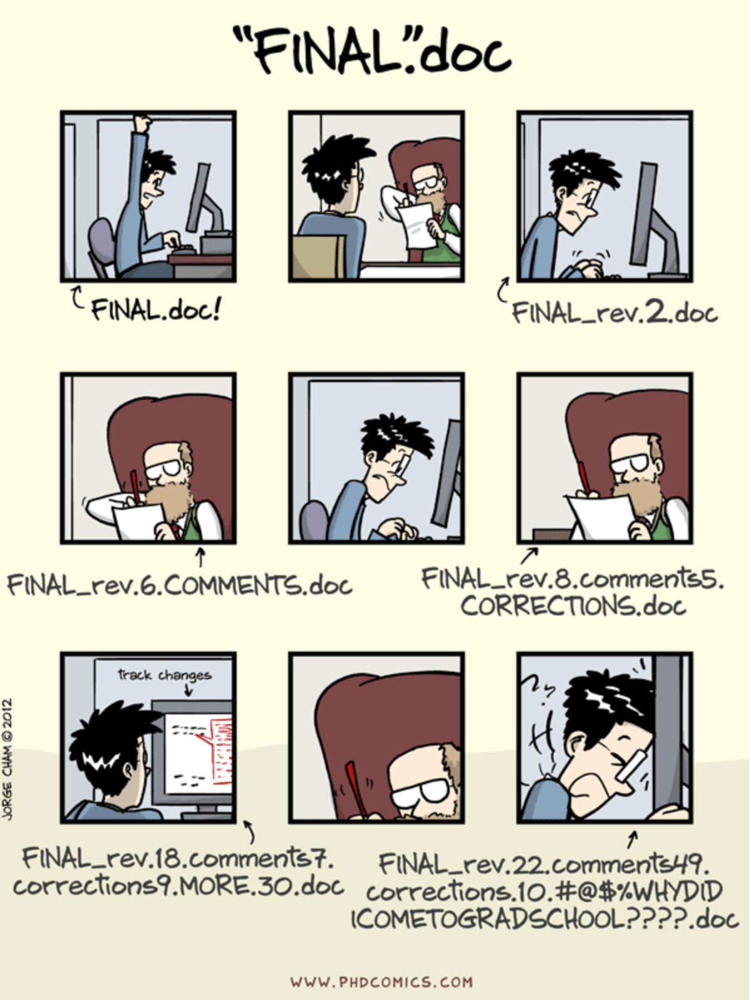

# Commit to Git?

#### A short introduction to version control in computational sciences

<br>
<br>

04.12.2024
Julian Karl Bauer

<!--
Thank you for the kind introduction
and thanks for inviting me.

I really liked the presentation
'...'
Emil gave in the last Students Chapter.

An important building block for all the things Emil had talked about is version control.
This gave me motivation to kind of recycle a talk on Git basics I gave several years ago.

Probabyl the world changed and all of you have a profound understaning of
what version control is and how to use it.
But I was encouraged, that recaping the basics, might be a thing worth doing.
I have a feeling that the invitation may have raised expectations
that are a little too high among experienced Git users.
Sorry in advance, my talk will be basic.

I will give a rough introduction to basic concepts of version control with Git.
Let's start
-->

---

<!-- _class: outline -->

### Outline (Just for development of these slides)

- What is Git?
- Which problem does Git solve?
- File structure
- Actions on a file structure
- Motivation workflow
- FINAL.doc
- What is it like to work with Git?
- Where does Git store all the information?
- Example: Change a file
- Git stages
- Remote
- Sequential / Parallel?
- Conflicts
- Branching
- How to ignore specific files?
- Do you really use a terminal?

---

### Terminology: File structure

<div class="columns">

<div style="display: flex;">

<style scoped>
pre {
   font-size: 25px;
}
</style>

```bash
$ tree

.
|
├── file1.txt
├── file2.txt
├── dir1
│   ├── dir2
│   │   ├── file3.txt
│   │   └── file4.txt
│   └── file5.txt
├── dir3
│    ├── file6.txt
│    ...
│    └── file12.txt
...

```

</div>

<!--
Let's start with some terminology.
During this talk, I will use the word file structure to refer to
a bunch of files within potentially nested directories.

So essentially it's a folder containing files on your filesystem.
-->

---

### What is Git?

<br>

<!-- prettier-ignore-start -->

* The second big project of Linus Torvald (the Linux guy)
* A distributed version control system
* Command line interface (CLI)
* A [content-addressable filesystem][git_internals]

<!-- prettier-ignore-end -->

[git_internals]: https://git-scm.com/book/en/v2/Git-Internals-Git-Objects

<!--

Let's go back to the main question:
What is Git?

There are certainly a number of legitimate answers...
For example:
- ...

These answers address different aspects of Git.

The first one obviously tries to create interest by referencing a well-known person.
But it might also refer to the significance of Git.
Like Linux, Git is involved everywhere, once you are able to see it.

The second and third essentially tell you, Git is software
and you can use it from your terminal.
And these are the things we will focus on.
We'll discuss what a distributed version control system is
and how to use it, focusing on the command line interface.

The fourth information is just a reference for those of you
who want to dig deeper into the machinery.
I can't tell you much about it, read it once, forgot it long time ago,
because it is not really essential for a user of Git.

-->

---



### Which problem does version control (e.g., Git) solve?

<sup>[image source][1]</sup>

[1]: https://phdcomics.com/comics/archive_print.php?comicid=1531

---

### Which problem does Git solve?

<br>

**Track changes** to a **file structure** including **metadata** on

- Who: Author
- When: Timestamp
- Why: Elaboration in commit message

and **enable structured collaboration** among team members.

---

# Multi columns in Marp slide

<div class="columns" style="display: flex;">
<div style="flex: 1;">

#### Column 1

Lorem ipsum dolor sit amet consectetur adipisicing elit. Voluptas eveniet,

</div>
<div style="flex: 2;">

#### Column 2

Tempore ad exercitationem necessitatibus nulla, optio distinctio illo non

</div>
</div>

---


