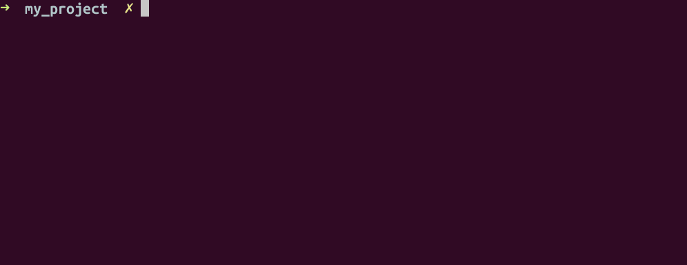

# Commit to Git?

#### A short introduction to version control in computational sciences

<br>
<br>

04.12.2024
Julian Karl Bauer

<!--
Thank you for the kind introduction
and thanks for inviting me.

I really liked the presentation
"Reproducibility and Data Management in Computational Science"
Emil gave in the last Students Chapter.

One important building block on the things Emil had talked about is version control and
this motivated me to recycle a talk on Git basics I gave several years ago.

Probabyl the world changed and all of you have a profound understaning of
what version control is and how to use it.
But I was encouraged, that recaping the basics, might be a thing worth doing.
I have a feeling that the invitation may have raised expectations
that are a little too high among experienced Git users.
Sorry in advance, my talk will be basic.

I will give a rough introduction to basic concepts of version control with Git.
Let's start
-->

---

### What is Git?

<br>

<!-- prettier-ignore-start -->

* The second big project of Linus Torvald (the Linux guy)
* A distributed version control system
* Command line interface (CLI)
* A [content-addressable filesystem][git_internals]

<!-- prettier-ignore-end -->

[git_internals]: https://git-scm.com/book/en/v2/Git-Internals-Git-Objects

<!--

The major question of this talk is:

What is Git?

There are certainly a number of legitimate answers...
For example:
- ...

These answers address different aspects of Git.

The first one obviously tries to create interest by referencing a well-known person.
But it might also refer to the significance of Git.
Like Linux, Git is involved everywhere, once you are able to see it.

The second and third essentially tell you, Git is software
and you can use it from your terminal.
And these are the things we will focus on.
We'll discuss what a distributed version control system is
and how to use it, focusing on the command line interface.

The fourth information is just a reference for those of you
who want to dig deeper into the machinery.
I can't tell you much about it, read it once, forgot it long time ago,
because it is not really essential for a user of Git.

So, let us focus on Git being a version control system
and the command line interface which allows us to use it.

What does version control system mean?

-->

---

### File structure

<br>

<div class="columns2">

<div style="display: flex;">

<style scoped>
pre {
   font-size: 22px;
}
</style>

```bash
$ tree
.
|
├── file1.txt
├── file2.txt
├── dir1
│   ├── dir2
│   │   ├── file3.txt
│   │   └── file4.txt
│   └── file5.txt
├── dir3
│    ├── file6.txt
│    ...
│    └── file12.txt
...
```

</div>

<!--
Let's start with some terminology.
During this talk, I will use the word file structure to refer to
a bunch of files within potentially nested directories.

So essentially it's a folder containing files on your filesystem.
-->

---

### What is version control?

<br>

**Tracking changes** (What) to a **file structure** including **metadata** on

- the author (Who)
- a timestamp (When)
- and motivation in terms of a commit message (Why).

This **enables structured collaboration** among team members.

<!--
Version control is build to
...

Using version control, you get the
- What (the changes)
- Who (Author) and
- When (Timestamp)
for free and automated.

This helps you to focus on the Why,
which commonly is encoded in terms of a Git commit message.
This is a free text piece of metadata you can post on every change.

(Maybe refer to developers of Linux kernel...)

So we can track changes to a file structure.
What kind of changes are there?
-->

---

### Which types of changes to a file structure are possible?

<br>

- Change the content of a file (`echo "..." >> file.md`, ...)
- Create a new file (`touch file.md`, `echo "..." > file.md`, ...)
- Delete a file (`rm file.md`)
- Rename / Move a file (`mv file.md file2.md`)

<!--
The kind of actions are actually limited.
Which is great.
We can ...
-->

---


### Which problem does version control (e.g., Git) solve?

<sup>[image source][1]</sup>

[1]: https://phdcomics.com/comics/archive_print.php?comicid=1531

<!--
Which problem does version control solve?

There is this nice visualization of a problem,
probably everyone who has written a bachelor's or master's thesis,
might have faced.

You start working on a file (hopefully not using MS Office like in the drawing),
you reach a reasonable state which seems to be the final one,
but it isn't.
You share a state with your collaborators / or supervisor,
you get comments back, you do changes, you exchange new versions of your work.
While waiting on the review, you might advance into a different direction.

This process might repeat and you end up with
several copies with slightly varying content.

This process easily get's confusing,
especially if you have more than once collaborator
or more than one route of changes to go (variants..).

Wouldn't it be nice to have just one document,
being able to work into different directions, so to say, branches of your work
and then eventually combine the branches / version which proofed to be benefial?
There are solutions to these desires and the group of solutions is called version control systems.

For MS Office products, nowadays there are collaboration features in place.

If your working on text files, no matter whether it is
code, documentation, presentation, evaluation, visualization,
there is a class of software that helps you to keep the overview of all the changes.

This class of software is version control systems.
-->

---

### Typical workflow of computational science.


<!--
If you're not completely with me,
when I try to motivate version control systems using proprietary / commercial formats, I understand.

Let's look at a typical workflow in the field of computational science.
Usually, we start with some kind of data.
This could be the output of an experient
or a numerical simulation.

We then do some analysis or further comuptation,
often based on scripting logic (here called Analysis) which itself makes use of some kind of library.
We might develop the library on our own as part of a codebase.
The output of the analysis represents our result,
which often is a visualization or data prepared to get visualized.

The details to not matter, but I think this general pattern is applicable to most of your projects.

But all of these parts, usually are dynamic, right?
We work on this project and therefore,
there might be changes to... which influence the result, ...

-->

---

### Typical workflow of computational science.


---

### Typical workflow of computational science.


---

### Typical workflow of computational science.


---

### Typical workflow of computational science.


<!--

Keeping track of these changes, is what version control helps us to do.

 -->

---

### How do we use Git?

Sequences of terminal **commands**
or using a **graphical interface**, e.g., within VSCode.

<br>

<div class="columnsflex">
<div>

Passive

```properties
git status
git diff
git log
git blame
...
```

</div>
<div>

Active

```properties
git add
git commit
git push
git pull
git merge
git checkout
...
```

</div>
</div>

<!--

How do we use Git?

There are actually two ways of interacting with Git.
First option is to use the command line and enter commands.
This is what we will look closer at during the next slides.
The Second option is to use a graphical user interface, e.g.,
the version control view within MS Studio Code.

I highly recommend using a graphical UI, because it will speed up your work a lot.
Nevertheless, it is really beneficial to start using Git with a terminal.

Here I listed the commands which I most frequently use
and I divided those commands into two groups:

passive commands which essentially only show you information about
the current state of your Git repository as well as

active commands which actively change the state.
The commands are...

 -->

---

### When does Git work?

<br>

Only during command execution.

<!--

The next thing that might be interesting is:
When does Git actually do something?

And the answer is "Only during command execution".

 -->

---

### Where does Git work? (`.git`)

<br>

<div class="columns2">
<div style="flex: 10;">

```properties
➜  git_basics_slides tree -a -L 1
.
├── assets
├── .git
├── .github
├── .gitignore
├── LICENSE
├── main.md
...
├── README.md
├── themes
└── .vscode
```

</div>
<div style="flex: 8;">

```properties
➜  .git tree -a -L 1
.
├── branches
├── COMMIT_EDITMSG
├── config
├── description
├── FETCH_HEAD
├── HEAD
├── hooks
...
├── objects
...
```

</div>
</div>

<!--

Where does Git work?

Within a hidden directory inside the top-level directory of the file structure
which you want to track the changes of.

On the left you see a tree-visualization of the directory which has been used to create these slides
and you might notice a directory which starts with a dot and reads .git.
On the right you see a closer look of this hidden directory and can inspect the internals of Git.

Within this .git directory, all the history and the metadata of your file structure is stored in an efficient way.
That means, any file structure with the latest state of the hidden .git directory contains all the information
which git stored on the history of your file structure.

However, you are higly discouraged from ever fiddling around in this directories content.
The only way to interact with git is through the command line interface or a GUI.
Do not touch the .git directory.

 -->

---

### Example: Project Directory

<br>

<div class="columns2">
<div>

Directory

```properties
➜  my_project tree
.
└── main.py

0 directories, 1 file

```

</div>
<div>

File: `main.py`

```python
# main.py

name = "bill"

print(name)

```

</div>
</div>

<!--

I think it is time for a small example.
Let's consider the following situation.

You already worked on a directory called `my_project`
which contains one Python file `main.py`.

You can see the content of this file on the right.

How can we start tracking changes on this file structure and
what will it look like to work with git on this file structure?

-->

---

### Example: Project Directory -> Git Repository (Init, Status)

<br>



<!--
We can tell the command line interface Git to start tracking changes of this filestructure
by turning the file structure into a Git repository.

We do this by initializing the file structure.
So we navigate to the top-level of the file structure and use the command `git init`.

Git tells us, that it created a directory `.git` within the top-level directory of my_project.

If we query git on the current status of my_project, it tells us that
- we are on branch main
- there are no commits yet
- there are untracked files (untracked means that we did not tell git yet to start tracking changes of these untracked files)
- and that we have nothing added to commit.

We'll see what this means within a moment.

Notice, that Git gives us hints on what we might want to do...
Git is very supportive nowadays.
-->

---

### Example: Project Directory -> Git Repository (Add)

<br>


<!--

Let's follow Git's advice and add our yet untracked file main.py.

The next status we see is that,
there are changes to be committed.

If we did a mistake and accidentially added a file, Git tells us how to undo the 'git add' command on a specific file.

However, we want to proceed and commit the changes.

 -->

---

### Example: Project Directory -> Git Repository (Commit)

<br>


<!--

Consequently, we issue the command `git commit`
including a so called commit message which migth contain details on our motivation of this specific change.

Oops, Git has a problem and tells us about it including instructions on how to proceed.

As Git tracks metadata on WHO does something, we have to tell Git who we are.
We usually have to do this only once a new PC if we follow Git's advice to
configre the users name and email globally.
However, if you find yourself working with multiple identities, e.g., within different open source projects,
work-related content and private content, you might be better off configurung each project independently.

Let's do this on the next slide.

 -->

---

### Example: Project Directory -> Git Repository (Config)

<br>


<!--

We configre the users name and email and enter the commit command again.

This time we are able to commit the changes and get notified about the changes.

One file changes with 4 lines inserted.
The file has been created and mode 100644 indicates that this file is a "Regular non-executable file"
called main.py

-->

---

### Example: Project Directory -> Git Repository (Log)

<br>


<!--

We can always investigate the latest history of a git repository with
git log.

Here you see, that there is only one commit with hash
0166b9f...
Git hashs or at least the first letters of the hash are frequently used to refer to specific commits.
(You find details on the internals of the content-addressable filesystem from the docs if you like.)

 -->

---

### Example: Change a file

<br>

<div class="columns2">
<div>

Old

```python
# main.py

name = "bill"

print(name)

```

</div>
<div>

New

```python
# main.py

name = "bob"

print(name)

```

</div>
</div>

<!--

Now we have a git repository configured and can track further changes.

Let's start with changing the file main.py

bill -> bob


 -->

---

### Example: Change file content (Status)

<br>


<!--

We can use the git status command again to get an overview about the current state
and you see that git noticed our changes to the file.
The file is modified.

 -->

---

### Example: Change file content (Diff)

<br>


<!--

Before we actually add and commit the new changes, let's validate whether the changes detected by Git
met our expectations.

Using diffs before advancing is generally a great advice.
You should always have the best tools in place to see what is going on.

 -->

---

### Example: Change file content (Status)

<br>


---

### Example: Change file content (Add)

<br>


<!--

Now that we validated the changes, let's add the changes to the so called stage,
i.e., the bucket to prepare the next commit.

You see, Git now treats the file as staged and ready to be committed.

 -->

---

### Example: Change file content (Commit, Status)

<br>


<!--

We think about a commit message encoding our motivation to do the change.
(What actually changed is documented automatically, so let's focus on our motivation)

Actually it is beneficial to invest some time and study some recommendations on good commit messages.
Your colleagues and future-you will love you for caring about commit message content.

Git status tells is, that everything is clear.

 -->

---

### Example: Change file content (Log)

<br>


<!--

And the history now contains two commits.

 -->

---

### Git stages


<sup>[image source][2]</sup>

[2]: https://medium.com/@zjpjack/reverting-modified-in-4-stages-in-git-f3997f526902

<!--

Let's have a quick look at the Git stages.

You saw that we used git add followed by git commit.
Add moves changes from your local workspace to a so called staging area.
The staging area can be seen as a bucket to collect all the changes which you want to group within the next commit.
Ususally you change more than just one file simultaniously.
Local repository refers to the content of the local .git directory and represents the memory of your local git repo.

 -->

---

### Git stages


<sup>[image source][2]</sup>

<!--

Usually, yoou do not only have your files locally, but you might also want to share the repo content with
other machines or collegues.
A remote repository, susually hosted on Github or Gitlab server helps you doing so
and the commands to interact with this remote are git push and gut pull.

 -->

---

### Git stages


<sup>[image source][2]</sup>

<!--

Similar to the local staging area, there is an intermediate layer between the remote and your
local git directory, which is called remote / origin repository and which is actually part of your local
git directory.

The motivation for this intermediate layer is kind of "look at what comes from remote before you decide to actually merge it into your local workspace".
In practise, most of us take the shortcut and git pull directly.

 -->

---

### Remote


<sup>[image source][3]</sup>

[3]: https://www.zentao.pm/share/git-sync-remote-repos-update-179.html

<!--

Let's use an alternative view on the local and remote repos with a less detailed zoom.
What do we use the remote for?

To exchange our file structure between several local machines.

Local can push and pull to / from remote.

 -->

---

### Remote


<sup>[image source][3]</sup>

<!--

And another local machine can do the same.

 -->

---

### Remote


<sup>[image source][3]</sup>

<!--

And it is handy to have a browser-based view on the content as well.

 -->

---

### [Protocols](https://git-scm.com/book/ms/v2/Git-on-the-Server-The-Protocols)

<style scoped>
.temporaryDiv {
   font-size: 22px;
}
</style>

<div class="temporaryDiv">

- HTTP
- SSH

[See also Github authentication](https://docs.github.com/en/authentication/keeping-your-account-and-data-secure/about-authentication-to-github)

</div>


<!--

There are several protocols to interact with the remote and I recommend you follow the Github / Gitlab instructions and
set up SSH authentication.

Note that there are different URLs to get a remote repo to your local machine, depending on the protocol you chose.

 -->

---

### Conflicts

<div class="columns3">

<style scoped>
section {
   font-size: 24px;
}
pre {
   font-size: 20px;
}
</style>

<div>

Left

```python
# main.py

name = "Lui"

print(name)

```

</div>
<div>

Old

```python
# main.py

name = "bill"

print(name)

```

</div>
<div>

Right

```python
# main.py

name = "Randell"

print(name)

```

</div>
</div>

**Manually resolve the conflict**: Tell Git whether to use

- the left change
- the right change
- a combination of both
- something completely new.

[**Merge Tools**](https://stackoverflow.com/questions/137102/whats-the-best-visual-merge-tool-for-git)

<!--

Git has powerful algorithm to combine changes from multiple authors.
However, sometimes people do conflicting changes, e.g., change the same line of code simultaneously.

Such conflicts have to be resolved manually.
And there are several options...

 -->

---

### Branches

<br>

<!-- prettier-ignore-start -->


* Develop multiple features
* Develop different variants
* **Make a proposal**


<!-- prettier-ignore-end -->

<sup>[image source][5]</sup>

[5]: https://stackoverflow.com/a/63253135/8935243


<!--

Then there are branches which help you to develop ....

 -->

---

### Log "A Dog"

<br>


<sup>[image source][4]</sup>

[4]: https://stackoverflow.com/a/35075021/8935243

<!--

If you want nice logs, consider a dog...
Which looks like....

 -->

---

### Customized Log

<br>

```properties
➜  project git:(branch) git log --all --decorate --oneline --graph
```


<!--

Which looks like this.

 -->

---

### Git Config and global `.gitignore`

<style scoped>
pre {
   font-size: 26px;
}
</style>

<br>

<div class="columns2">

<div>

[Show config](https://stackoverflow.com/a/12254105/8935243)

```
git config --list --show-origin

file:/home/julian/.gitconfig    init.defaultbranch=main
file:/home/julian/.gitconfig    core.editor=vim
file:/home/julian/.gitconfig    core.excludesfile=~/.gitignore
file:.git/config        core.repositoryformatversion=0
file:.git/config        core.filemode=true
file:.git/config        core.bare=false
file:.git/config        core.logallrefupdates=true
file:.git/config        user.name=julian
file:.git/config        user.email=julian@blub.com
(END)
```

</div>

<div>

[Global `.gitignore`](https://stackoverflow.com/questions/7335420/global-git-ignore)
(e.g. `.venv`, `.DS_Store`, ...)

<!-- - Create file `touch ~/.gitignore`
- Configure `git config --global core.excludesFile '~/.gitignore'`
- Lookup `git config --get core.excludesfile` -->

```
➜  touch ~/.gitignore

➜  git config --global core.excludesFile '~/.gitignore'

➜  git config --get core.excludesfile
~/.gitignore
```

</div>
</div>

<!--

You don't always want to version control all files...
And usually you can specify those files which should not be tracked in terms of paths or file endings.

Git-Pros use global .gitignores to not repeat the instructions on common files to be excluded over and over again.

You don't want to annoy your collaborators by always ignoring your MAC-OS-files.

 -->

---

### [Git Large File Storage (LFS)](https://git-lfs.com/)

- Keep repos small
- Work like you always do


<!--

There is Git Large File Storage to keep repos small and work with large files as if they were small.

 -->

---

### Summary

<br>

- The Git way of working: Change, add, commit, pull, push, repeat
- Applications:
  - File structures, e.g.,
    - Any computational project
    - Latex

<!--

I hope you learned what version control is about.

I hope to have motivated a cycle of
change
add
commit
pull
push
repeat

Applications: Everything which represents a file structure.

 -->

---

### Related topics

- Git in your integrated development environment (IDE)
- Hooks, e.g., `pre-commit`
- Github / Gitlab
- Continuos integration (CI) with Github Actions / Gitlab CI/CD
- [Git workflows][git_workflows_atlassian]: Centralized, feature branching, gitflow workflows, forking workflow

[git_workflows_atlassian]: https://www.atlassian.com/git/tutorials/comparing-workflows

<!--

I briefly listed related topics:

Consider using your IDE instead of the command line or a mixture.
Pre-commit is great for collaboration...

Git workflows: For efficient collaboration, it might be a good idea to discuss how you would like to use git in your team...
 -->

---

### Resources

- [Software Carpentry: Git-Novice](https://swcarpentry.github.io/git-novice/)
- [Git for beginners: The definitive practical guide](https://stackoverflow.com/questions/315911/git-for-beginners-the-definitive-practical-guide)
- [The Git docs](https://git-scm.com/doc)

<!--

To get started, I highgly recommend Software Carpentries

For further reading, see the following docs.

 -->

---

## Thank you for your attention!

<!--

Thank you :)
 -->
